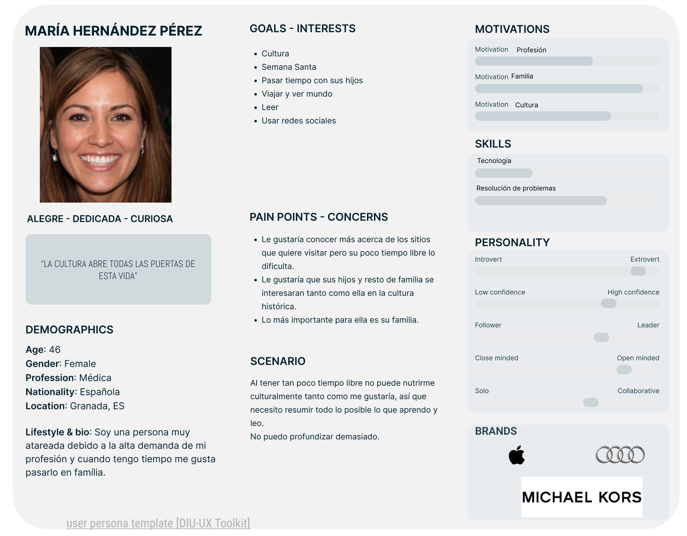
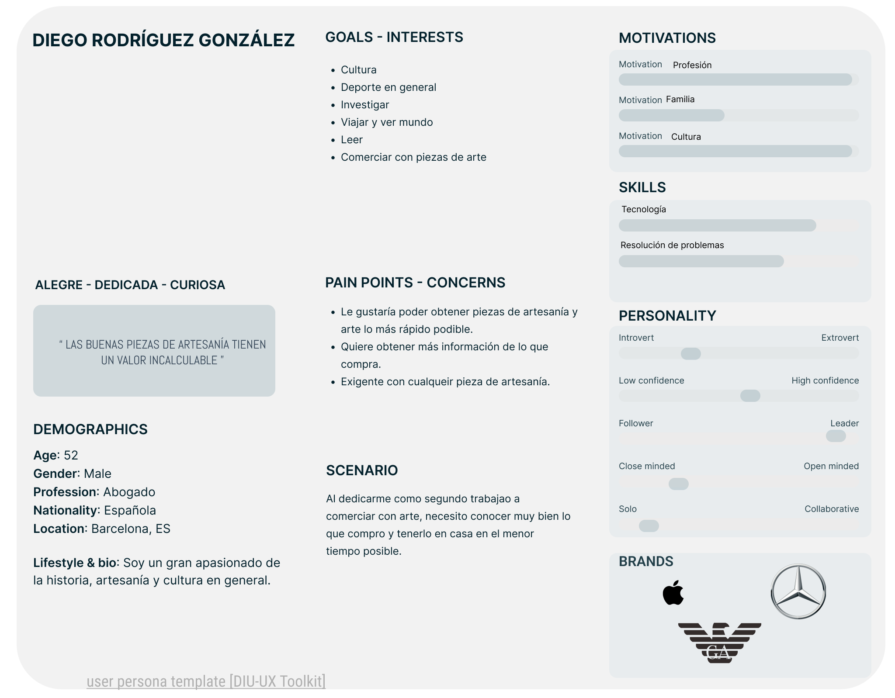
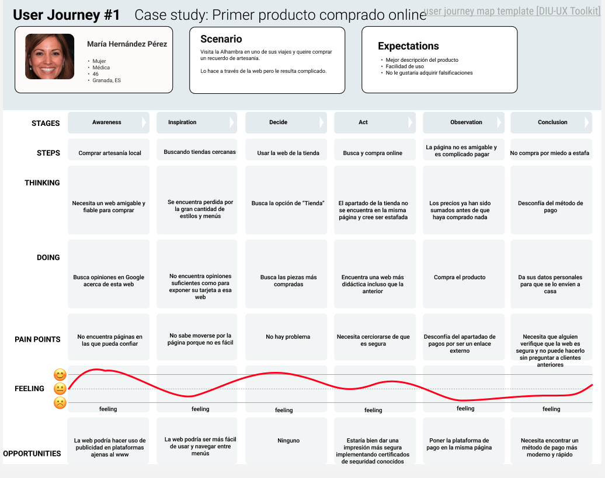
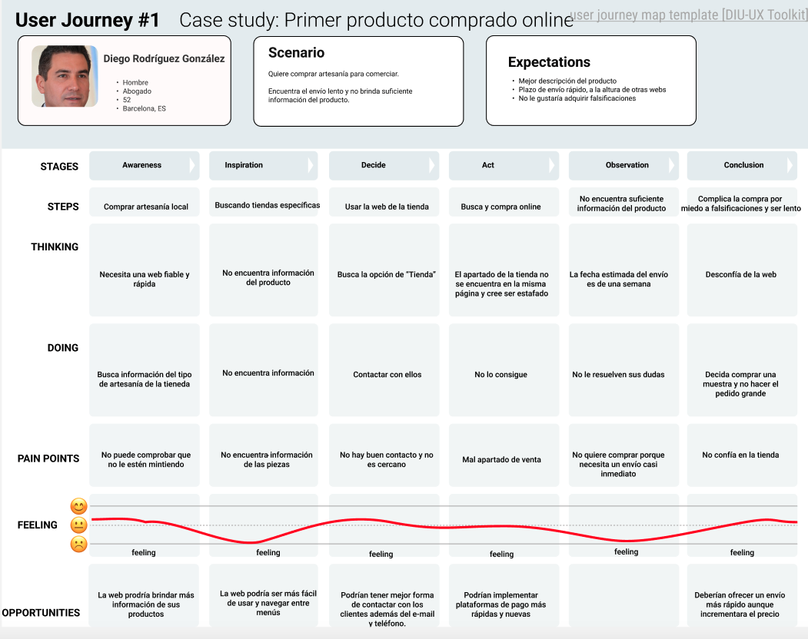

## DIU - Practica1, entregables

- Nombre del grupo: JARG
- Nombre de los autores: José Alberto Rodríguez Godoy
- Enlace a github: https://github.com/AlbertRG99/DIU/tree/master/P1

(valoración y conclusiones de esta etapa)

## EMPATHY MAPS

### Experiencia propia

### Experiencia de clientes

## COMPETITOR ANALYSIS

## PERSONA

## JOURNEY MAP

## USABILITY REVIEW

#### (Puntuación: 61 -> Experiencia media/moderada) 

Consultar el archivo "UsabilityReviewArtesaniaNazari.xlsx"

## BRIEFING

Como conclusión podemos decir que la experiencia de usuario es relativamente buena de forma general.

Como puntos a mejorar tenemos la mejora en los tiempos de envío.
Personas como Digo (de nuestro caso) necesitan obtener su producto lo antes posible en su domicilio.

Otro punto a mejorar sería la adaptabilidad de la página web ya que la mayoría de clientes suele usar el teléfono móvil y una web como la actual perjudica demasiado la experiencia de compra.
El cliente debe tener adaptada la página a su dispositivo y hacer zoom lo mínimo posible.

También se recomendaría el uso de publicidad en redes sociales y otras plataformas para dar a conocer el producto que se está ofertando junto con formularios de satisfacción a los clientes que compran en la tienda online y física.

Y como último punto, sería bueno que se se aliaran con otra web más conocida (ej: Amazon) para mejorar el asunto de los envíos y la facilidad de compra aunque estos se lleven un porcentaje de la venta.