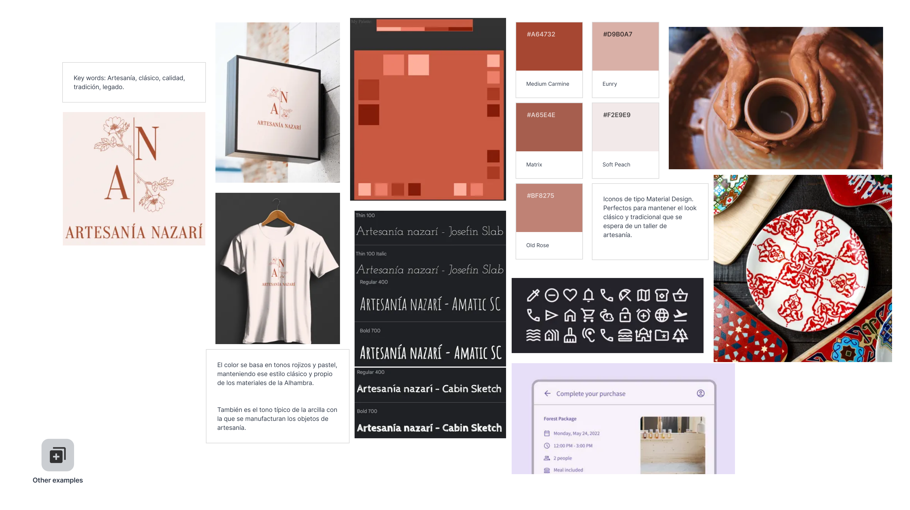
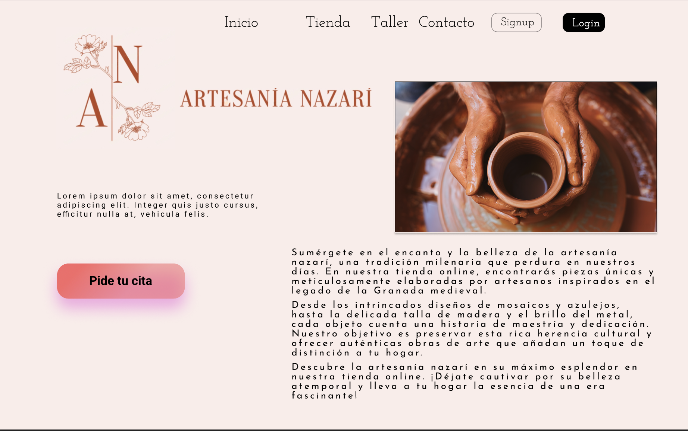
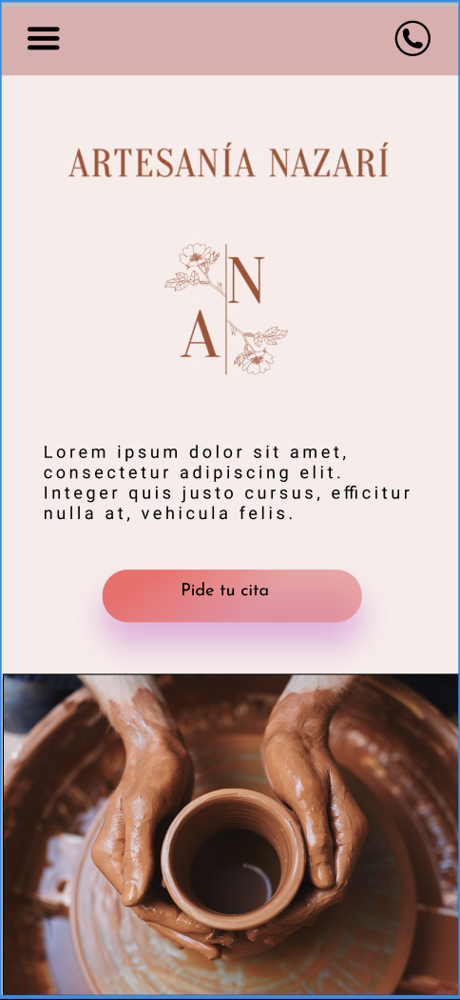
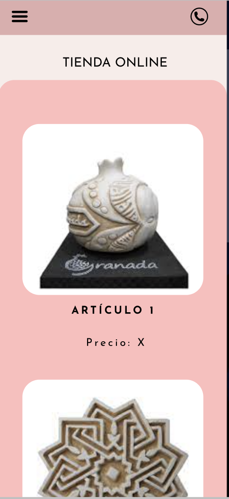
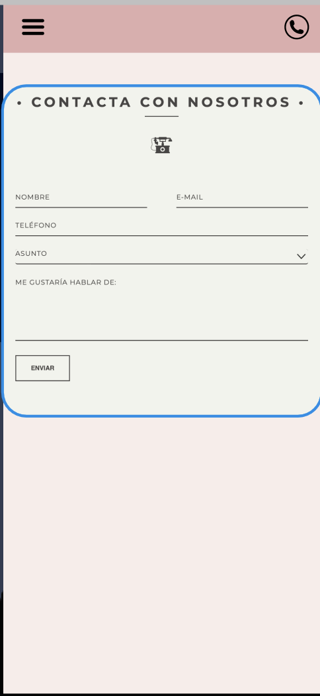

# DIU - Practica 3, entregables

## Moodboard (diseño visual + logotipo)

### Logotipo

### Diseño visual

## Landing Page

## Patrones/Guidelines

1. Menús desplegables: los menús desplegables son una forma común de presentar opciones en una interfaz de usuario. Los usuarios pueden hacer clic en un botón para abrir un menú que muestra opciones adicionales.
    Opciones ocultar referente a los talleres, o la tienda online de artesanía.

2. Tarjetas: Cuenta con un slider animado de imágenes y video a la derecha de la web.
    Usado para mostrar el contenido referente al overview e inicio de cada submenú, mostrando así un resumen de la totalidad de la web.

3. Barras de navegación: Ayuda a los usuarios a moverse por una página web o aplicación móvil. Las barras de navegación incluyen enlaces a las diferentes secciones del sitio web.

4. Diseño parallax: Crea una ilusión de profundidad en una página web al mover diferentes elementos a diferentes velocidades mientras el usuario se desplaza verticalmente por la página web de artesanía. 
    Se recrea superponiendo las capas de imágenes y banner de la zona derecha e izquierda con velocidades de desplazamiento diferentes, lo que crea la sensación de que algunos elementos están más cerca del observador y se mueven más rápido, mientras que otros están más lejos y se mueven más lentamente.

5. Animaciones: Mejora la experiencia del usuario y hacer que la interfaz sea más atractiva visualmente. Las animaciones incluyen transiciones suaves entre páginas, efectos visuales al hacer clic en un botón y otros efectos visuales interactivos como un botón principal que se mueve con el scroll.

## Mockup: LAYOUT HI-FI/Simulación

<video src='https://youtu.be/JYr-_ZNEoeQ' width=180/>

