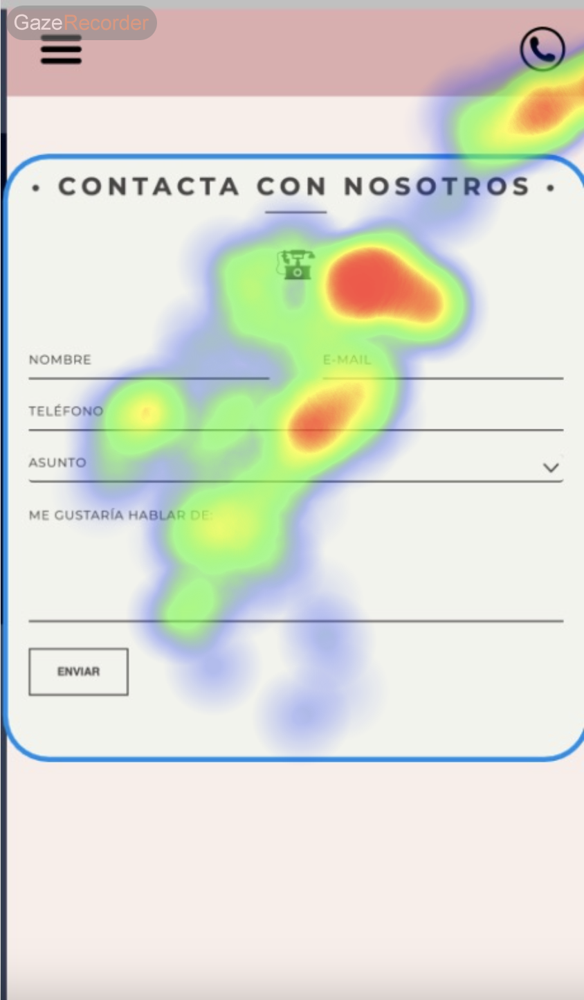
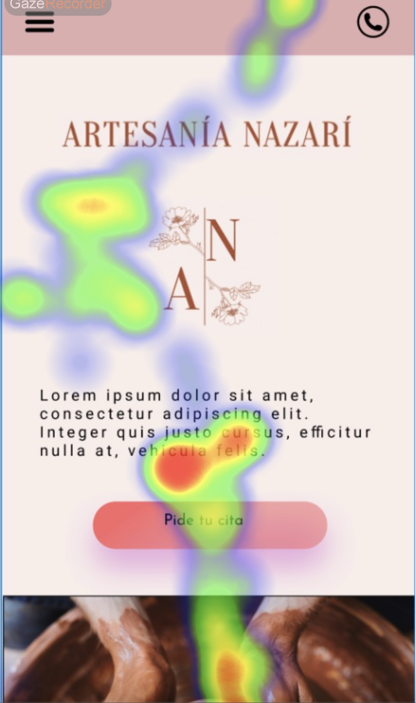

## Practica 5: entregables 

### [WCAG A11Y]  pautas de accesibilidad

### [A11Y SIMULATOR] simulador de discapacidad 

## EXPERIMENTO CON "EL PLATO"

### Heat Map:

#### Persona 1

Centra su atención principalmente en la zona de ofertas e imágenes de presentación.

Centra su atención principalmente en el mapa y las imágenes asociadas a los centros que representan a este.

Centra su atención principalmente en la zona de registro.

#### Persona 2

Centra su atención principalmente en las imágenes de presentación y en los menús de ordenación superior.

La atención se reparte de forma uniforme entre toda la pantalla.

Centra su atención principalmente en el área de registro de forma general.

### Area of Interes (AOI):

#### Persona 1

#### Persona 2

## EXPERIMENTO CON "ARTESANÍA NAZARÍ"

### Heat Map:

#### Persona 1

Centra su atención principalmente en el diseño y el logotipo clásico del teléfono, junto con el formulario de contacto.

Centra su atención principalmente en el botón de reservar cita y de manera secundaria en la imagen principal de la derecha y el logo.

Centra su atención principalmente en el nombre y precio del artículo.

#### Persona 2

Centra su atención principalmente en el icono de teléfono clásico y en el formulario.

Centra su atención principalmente en el texto de presentación del taller junto con el logo y la imagen de la derecha.

Centra su atención principalmente en el precio del producto.

### Area of Interes (AOI):

#### Persona 1

#### Persona 2

### CONCLUSIONES FINALES

#### "El Plato":

* Para la página de landing:

Los usuarios tienen un común denominador a la hora de observar la página y es la predilección por observar las imágenes de presentación de la portada.

Esto nos dice que se deben hacer notar las zonas que queremos que sean observadas con imágenes de colores que resalten y que atraigan visualmente al cliente.

Se debe aplicar lo anterior a la zona del botón de reserva ya que pasa casi desapercibido por los clientes y en ningún momento se le presta antención a esto, lo más importante.

* Para la página de búsqueda:

Los usuarios han observado de forma general a toda la página, lo que puede significar dos cosas:

-> Está muy sobrecargada de información.
-> Está perfectamente repartida la información.

Siendo la última opción mi opinión ya que tiene un diseño muy intuitivo para el cliente.

* Para la página de loggin:

El diseño es simple (quizá demasiado), sin estímulos que distraigan al cliente de su objetivo final, registrarse o iniciar sesión.

Agregaría un diseño más vistoso o inclusio eliminaría esta página, haciendo que sea un simple botón desplegable dentro de la página principal. 

#### :"Artesanía Nazarí":

* Para la página/ios de contacto:

Los usuarios han redirigido su mirada al logotipo clásico del teléfono, lo que quiere decir que aprecian un diseño bonito y monótono para toda la página.
Se cuida cada detalla de la web, dando a entender que es un reflejo de la artesanía que ellos venden.
Una pieza detallada y única.

Para esta página creo que no hay nada a mejorar que reseñar.

* Para la página/ios de landing:

Unos usuarios miraron más el botón de reserva mientras que otros se interesaron más por el texto de introducción.

Podríamos mejorar la página tratando de integrar más los textos con las imágenes a modo de timeline o "contar una historia".

La estructura de la página de inicio también podría ser mejorada equilibrando más el contenido y no sobrecargando más una parte de la pantalla.

* Para la página/ios de tienda:

Los dos usuarios lo tienen claro, se centrarn en el precio y en el nombre del producto. 

Lo que tratábamos de conseguir.