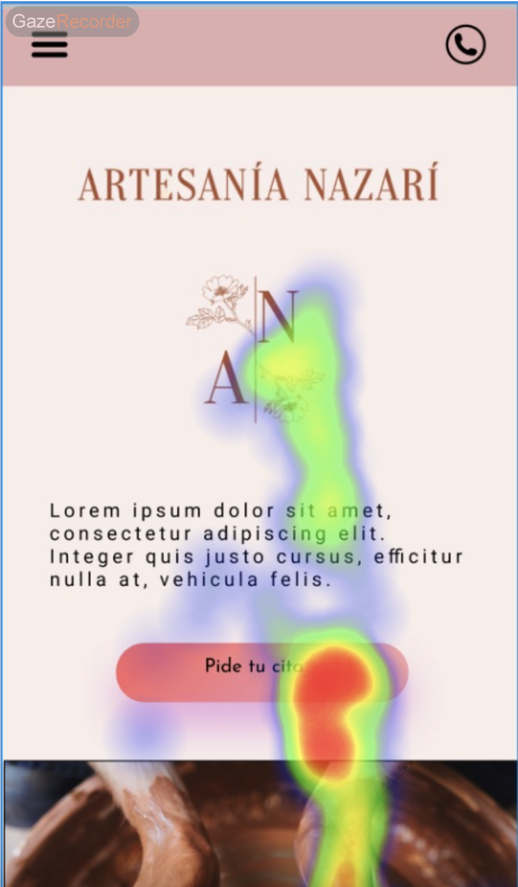
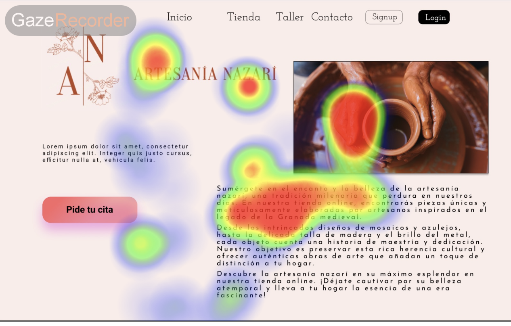
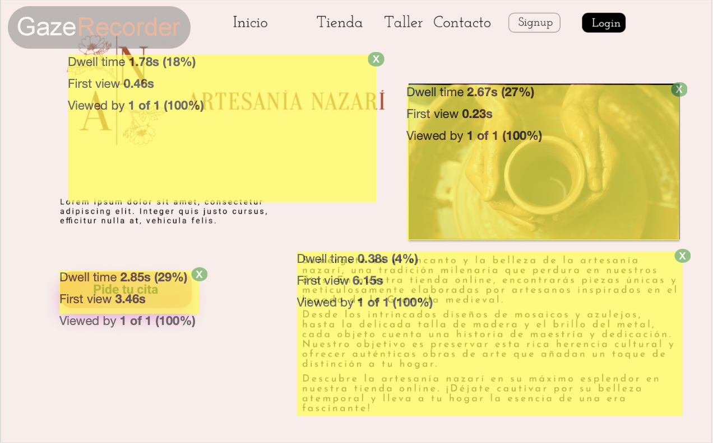

## Practica 5: entregables 

### [WCAG A11Y]  pautas de accesibilidad

### [A11Y SIMULATOR] simulador de discapacidad 

## EXPERIMENTO CON "EL PLATO"

### Heat Map:

#### Persona 1

#### Persona 2

### Area of Interes (AOI):

#### Persona 1

#### Persona 2

## EXPERIMENTO CON "ARTESANÍA NAZARÍ"

### Heat Map:

#### Persona 1

#### Persona 2

### Area of Interes (AOI):

#### Persona 1

#### Persona 2

### CONCLUSIÓN 

Conclusiones de apartados anteriores 

Puntos fuertes y de mejora de los criterios de accesibilidad de tu diseño
